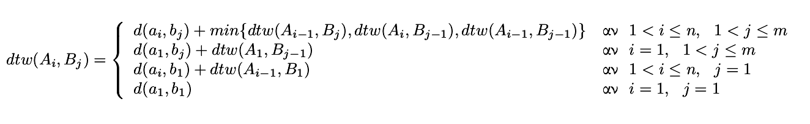
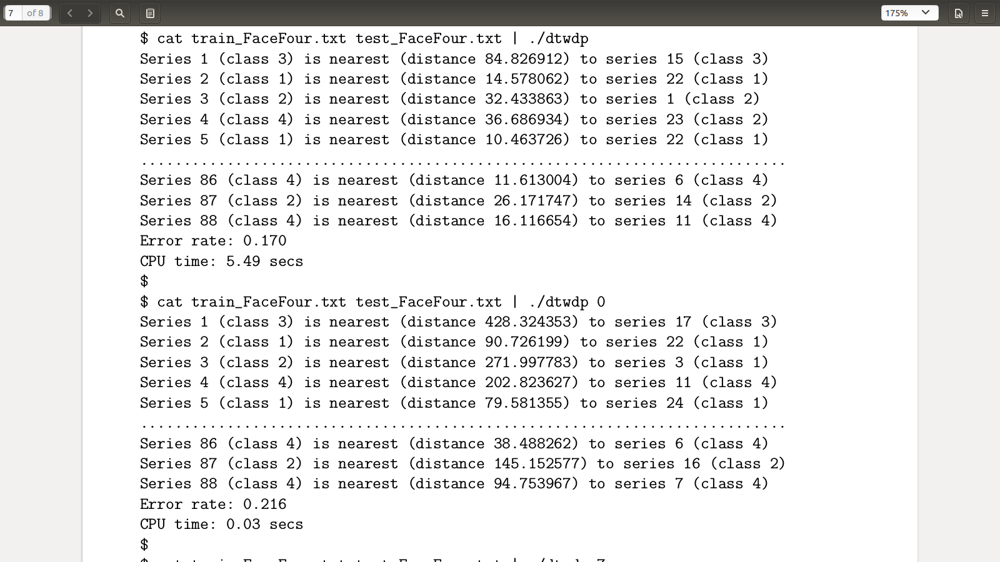
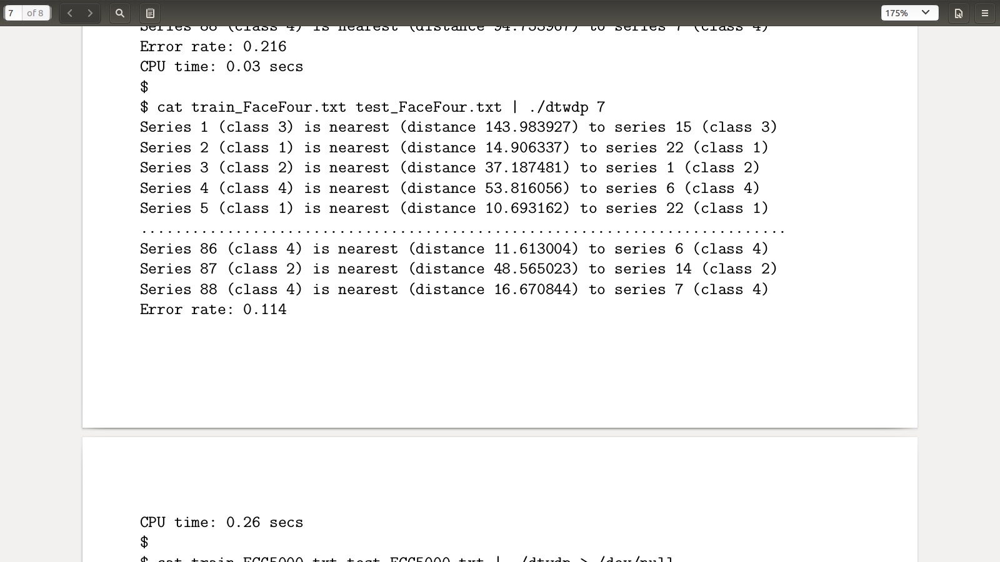
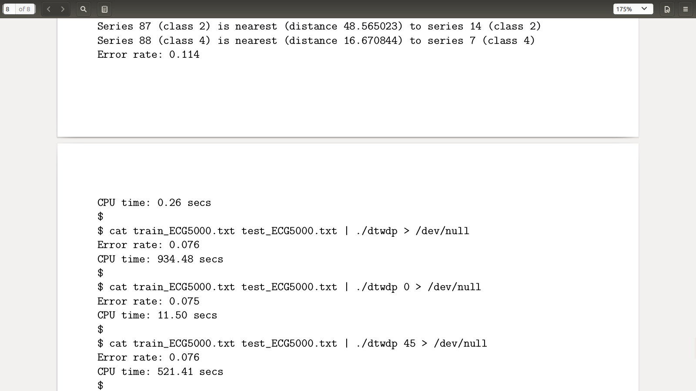

## Time-Series Classification with Dtw

Assume we have 2 time-series *A* and *B*. *A* has *ai* elements (1 <= i <= n) and *B* has *bj* elements (1 <= j <= m). Assuming that *d(ai,bj)* = *(ai-bj)^2* and that *min{x,y,z}* is the minimum of *x,y* and *z* the **_dtw_** formula is the following:




## Description

- The program can receive a user-defined non negative integer via the command line, which represents the "window" for the computation of the **dtw distaces**. If such an argument is not provided, we assume that a constraint/"window" does not exist(or equivalently the "window" is equal to infinity).

- The input of the program is the following: Initially, the number of time-series of a known class(**training set**) and their length is given in a single line(stdin). In the following lines, the actual time-series data is given. Specifically, this includes, firstly, the class of the time-series and then, the elements of the time-series. Similarly, the data of the **test set** is given next. In a single line we provide the number of time-series in the test-set and the length of each one. Then, in the following lines we give, firstly, the class of each time-series, which will be only used during the evaluation of the dtw classification process. After that, the elements of the test-set time-series follow. Note that the length of the time-series in the test-set must be equal to the length of the time-series in the training-set. If such a requirement is not satisfied, then the program must teminate.

- For each time-series in the test-set, the program must find one time-series from the training-set that is the most identical to it. Of course, the measure of similarity here is the dtw distance(with or without constraint). Therefore, the class of the timeseries in the test-set, which is unknown, is "predicted" to be the same as the class of that time-series from the training-set that was the most similar to it. If the class prediction was false, then we have 1 error. The error rate is printed out in the end.

- For **large time-series datasets**(both training-set and test-set), it is obvious that the **_recursive method_** will be terribly slow. The same might apply for the **_dynamic programming_** method as well in some cases, since the computation of the dtw distance of 2 time-series with length = *N*, requires an implementation with time complexity of *O(N^2)*. However, if a "window"/constraint **c** is given by the user, the dynamic programming method has a time complexity of **O(cN)**. 


## Execution

```
$ make dtwdp
```

The dtwdp is the recommended executable to be generated. Some sample executions are presented above.

```
$ cat train_FaceFour.txt test_FaceFour.txt | ./dtwdp
```
```
cat train_FaceFour.txt test_FaceFour.txt | ./dtwdp 0
```
```
cat train_FaceFour.txt test_FaceFour.txt | ./dtwdp 7
```



Notice how much the cpu time drops when a small *constraint* argument is given. Some more examples:

```
cat train_ECG5000.txt test_ECG5000.txt | ./dtwdp > /dev/null
```
```
cat train_ECG5000.txt test_ECG5000.txt | ./dtwdp 0 > /dev/null
```
```
cat train_ECG5000.txt test_ECG5000.txt | ./dtwdp 45 > /dev/null
```

